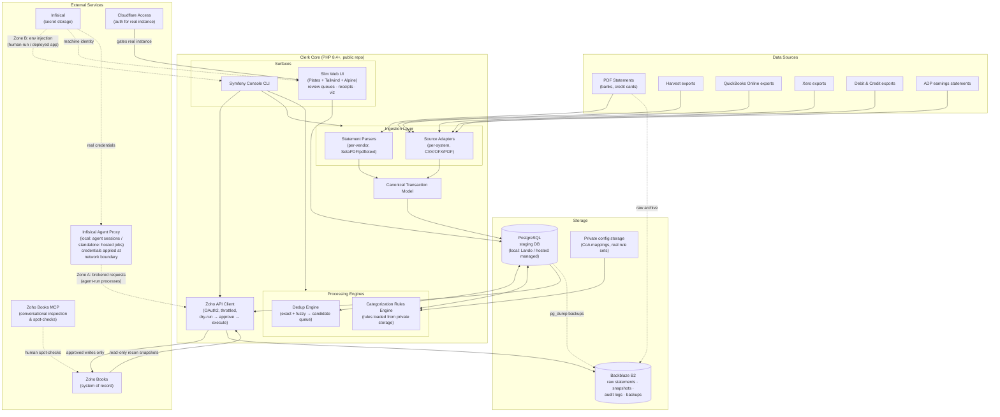

# Clerk — System Architecture

> Maintenance rule: this diagram is updated in the same PR as any structural
> change. It is diagram-as-code (Mermaid) so it renders on GitHub and diffs
> like source.

## v1 System Diagram

## Component Notes

**Canonical Transaction Model** — the contract everything converges on. Every
ingestion path produces it; every engine consumes it. Money stored as integer
minor units. Every record carries `source_system` + `source_record_id` +
`import_batch_id` for full attributability and reversibility.

**Trust boundary** — the staging Postgres DB is the workspace; Zoho Books is
the system of record. Nothing reaches Zoho except through the write client's
dry-run → human approval → execute pipeline. A mistake in ingestion,
dedup, or categorization can never touch the books directly.

**Public/private boundary** — this repo contains code, synthetic fixtures, and
docs only. Real data lives in gitignored `data/`/`output/`, Postgres, and B2.
Real rule sets and CoA mappings live in private storage and load at runtime.

**Secrets: two-zone model** — Zone A (agent-driven and autonomous execution):
outbound HTTP is brokered by the Infisical Agent Proxy via HTTPS_PROXY; real
credentials are applied at the network boundary and never enter the agent's
environment (prompt-injection exfiltration defense). Zone B (human-run
commands, deployed app runtime): `infisical run` env injection locally,
machine identity in deployment. Flows that cannot be proxy-brokered fall back
to per-process env injection with no-echo rules (see decisions.md D-013).

**Data access** — cakephp/orm standalone (ConnectionManager + TableLocator
bootstrap, Table/Entity classes) over Postgres; Phinx migrations. No raw SQL
in application code. Templates are native PHP via Plates with a mandatory
escaping convention; no Node toolchain (Tailwind standalone binary, vendored
Alpine).

**Deployment shape** — local: everything in Lando. Hosted: Cloudflare
(DNS/CDN/Access) fronts the app; compute on DO App Platform; DO Managed
Postgres adjacent to compute; B2 for objects. Real instance behind Cloudflare
Access; demo instance public with seeded synthetic data. Cloudflare-only
hosting ruled out: no production PHP runtime on Workers.
